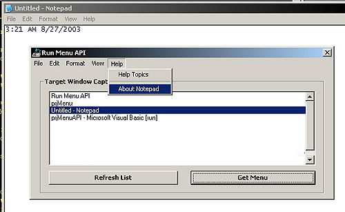



## API Menu Example v2

### Description

Like the first version, this shows how to access another application's menu and copy it in your own app using API...allowing you to actually call the menu functions in the other application from your menu.

The example creates a list of current windows (only windows with compatible menus). Then when selected, the menu is 'cloned' using API calls GetMenuItemInfo() and InsertMenuItem() allowing you to not only to copy the menuitem but the state of the menuitem.(Checked, Grayed, etc...)

And unlike the first version which only loaded 1 level of submenus, this will load all levels.

This example could also prove to be useful to anyone wanting to know more about creating dynamic menus and submenus in VB as well as how to handle messages from them when clicked (uses subclassing). Unlike many 'dynamic menu' examples, this does not require any 'dummy' menus or menu arrays to be created.

Demonstrates API Calls: IsWindow, SetWindowLong, EnumWindows, GetMenuItemCount, GetSubMenu, GetMenu, SetMenu, DestroyMenu, CreateMenu, CreatePopupMenu, DrawMenuBar, CallWindowProc, PostMessage, GetWindowTextLength, GetWindowText, IsMenu, GetMenuItemInfo, & InsertMenuItem.
 
### More Info
 

             |
---                |---
**Submitted On**   |2003-09-01 04:13:28
**By**             |[Danny Krotzer](https://github.com/Planet-Source-Code/PSCIndex/blob/master/ByAuthor/danny-krotzer.md)
**Level**          |Advanced
**User Rating**    |4.8 (87 globes from 18 users)
**Compatibility**  |VB 4\.0 \(32\-bit\), VB 5\.0, VB 6\.0
**Category**       |[Windows API Call/ Explanation](https://github.com/Planet-Source-Code/PSCIndex/blob/master/ByCategory/windows-api-call-explanation__1-39.md)
**World**          |[Visual Basic](https://github.com/Planet-Source-Code/PSCIndex/blob/master/ByWorld/visual-basic.md)
**Archive File**   |[API\_Menu\_E163890912003\.zip](https://github.com/Planet-Source-Code/danny-krotzer-api-menu-example-v2__1-48141/archive/master.zip)

